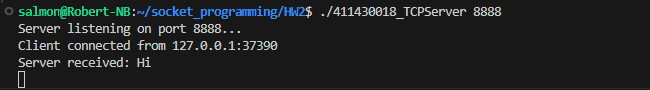
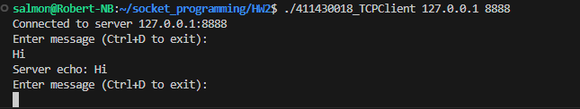
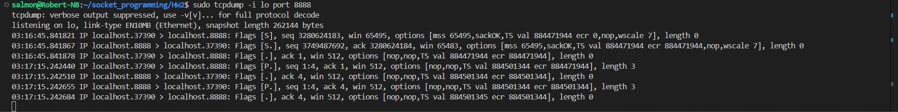

# Chapter 2: TCP Sockets Programming

- **Name:** (Shang-Long Wu)
- **Student ID:** (411430018)

---

## 1. Program Description

This project implements a pair of TCP client/server programs in C on a LINUX environment, as per the assignment requirements.

* **Server**: Starts and listens on a specified port, waiting for client connections.
* **Client**: Connects to the specified server IP and port.
* **Functionality**: The server receives any string from the client and automatically echoes the identical string back to the client.

---

## 2. Archive Contents

```
.
├── 411430018_TCPServer.c  (Server source code)
├── 411430018_TCPClient.c  (Client source code)
├── Makefile               (Compilation makefile)
├── 411430018_Readme.pdf   (This readme file)
└── Image/                   (Screenshot directory)
    ├── server.png
    ├── client.png
    └── packet_capture.png
```

---

## 3. How to Compile and Run

This project includes a `Makefile` and can be compiled using `gcc` or `clang`.

### Compilation

In the terminal, execute the `make` command in the project directory:

```bash
make
```
This command will automatically compile and generate two executables: `411430018_TCPServer` and `411430018_TCPClient`.

To clean the compiled executables, run:
```bash
make clean
```

### Execution

You will need to open **two** terminal windows (or three if capturing packets).

**A. Run the Server (Terminal 1)**

First, start the server and specify a port number.

```bash
# Example, using port 8888
./411430018_TCPServer 8888
```
The server will display `Server listening on port 8888...` and wait for connections.

**B. Run the Client (Terminal 2)**

Next, start the client, specifying the server's IP and port.

```bash
# Example, connecting to localhost (127.0.0.1) on port 8888
./411430018_TCPClient 127.0.0.1 8888
```
After a successful connection, you can start typing strings (press Enter to send). The server will echo them back.
Press `Ctrl+D` (EOF) to exit the client.

---

## 4. Essential Function Usage

This section describes the purpose of essential functions used in the programs.

### Server Side (411430018_TCPServer.c)

* `socket()`: Creates a new socket endpoint, specifying IPv4 (`AF_INET`) and TCP protocol (`SOCK_STREAM`).
* `bind()`: Binds the socket to a specific IP address and port number. The server uses `INADDR_ANY` to listen on all available network interfaces.
* `listen()`: Puts the socket into listening mode, preparing it to accept client connection requests.
* `accept()`: Accepts an incoming client connection. This function blocks until a client connects, then returns a **new socket file descriptor** dedicated to communicating with that specific client.
* `handle_client(int client_sock)`: (Custom function) Manages the request loop for a single client.
* `read()`: (in `handle_client`) Reads data from the client's socket.
* `write()`: (in `handle_client`) Writes (echoes) data back to the client's socket.
* `close()`: Closes the connection with the client.

### Client Side (411430018_TCPClient.c)

* `socket()`: Creates a new socket, same as the server.
* `inet_pton()`: Converts a human-readable IP address string (e.g., "127.0.0.1") into the network binary format.
* `connect()`: Initiates a connection request from the client's socket to the specified server IP and port (this is the start of the TCP 3-way handshake).
* `fgets()`: Reads a line of string from standard input (`stdin`, i.e., the user's keyboard).
* `write()`: Sends the user-input string to the server through the socket.
* `read()`: Reads the echoed data returned from the server through the socket.
* `close()`: Closes the socket connection.

---

## 5. Execution Result Screenshots

Screenshots of the program execution are included below.

### A. Server Execution

(Server starts listening, shows client connection and received messages)


### B. Client Execution

(Client connects successfully, sends messages, and receives the server's echo)


### C. TCP Packet Capture (3-Way Handshake)

(Use `tcpdump` to capture the full exchange)
- **Lines 1-3:** The TCP 3-way handshake (`[S]`, `[S.]`, `[.]`) establishing the connection.
- **Lines 4-7:** The data transfer for the string "Hi" (which is 3 bytes: 'H', 'i', '\n').
    - Line 4: Client sends "Hi" (`[P.]`, length 3).
    - Line 5: Server acknowledges the "Hi" (`[.]`).
    - Line 6: Server echoes "Hi" back (`[P.]`, length 3).
    - Line 7: Client acknowledges the echo (`[.]`).

